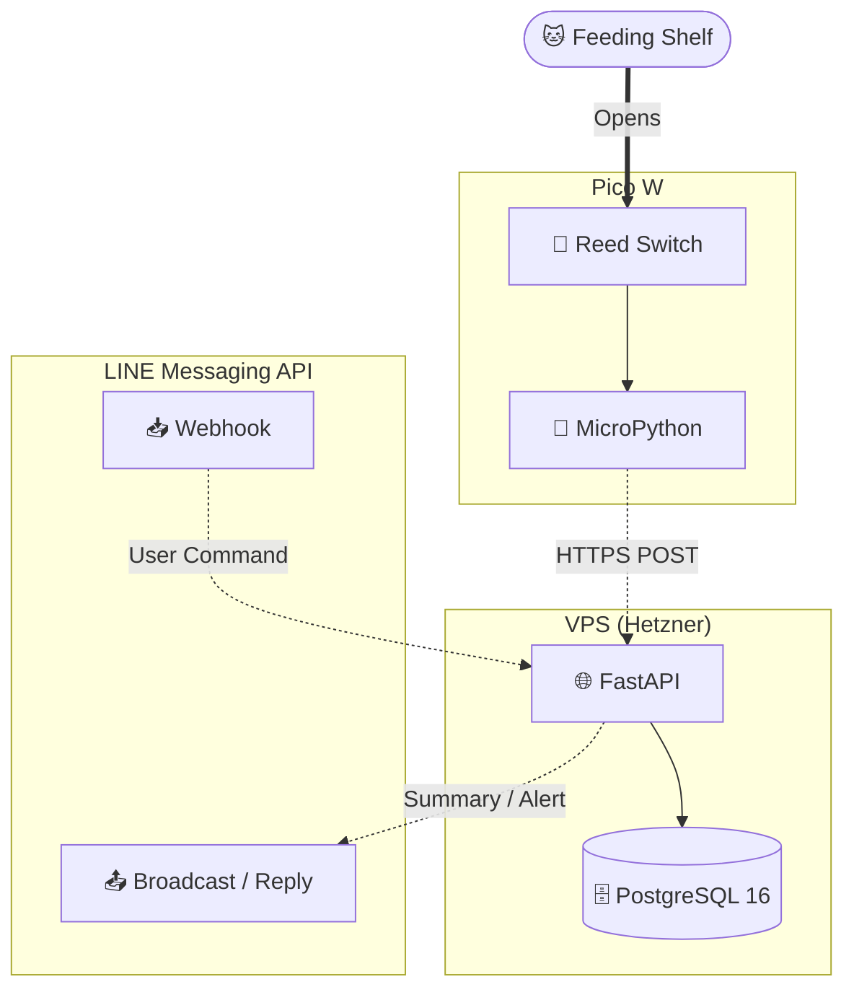

[🇯🇵 日本語](README.md) | [🇬🇧 English](README.en.md)

# cat-feed-tracker

[](https://github.com/yktsnet/cat-feed-tracker/actions/workflows/ci.yml)

Pico W のリードスイッチを介して給餌棚の開閉イベントを検知し、LINE で家族に通知を届ける IoT システムです。




## Quick Start

Docker Compose を使うと、PostgreSQL を含む全環境を一発で起動できます。

### Prerequisites

- **ハードウェア**: Raspberry Pi Pico W、リードスイッチ、マグネット
- **外部サービス**: LINE Developers アカウント（Messaging API チャネル）
- **実行環境**: Docker Compose（本番運用時は HTTPS 終端できるドメイン）

### Setup

```bash
git clone https://github.com/yktsnet/cat-feed-tracker.git
cd cat-feed-tracker

# 環境変数ファイルを作成し、LINE トークンを記入
cp .env.example .env
# LINE_CHANNEL_SECRET と LINE_CHANNEL_ACCESS_TOKEN を実値に書き換える

# 必要に応じて自分の猫に合わせて編集
# vi config/cats.yaml

# サーバーを起動（初回は DB の初期化を含む）
docker compose up -d
```

起動後、Pico W の DEVICE_TOKEN を DB に登録します。

```bash
docker compose exec db psql -U cat_feed -d cat_feed \
  -c "INSERT INTO devices (device_key, name) VALUES ('your-device-token', 'shelf-1');"
```

- API ドキュメント（Swagger UI）: http://localhost:8001/docs

---

## Overview

給餌棚の扉に付けたリードスイッチの開閉を「給餌イベント」として記録し、家族が普段使う LINE へまとめて届けることで、誰がいつ猫に餌をあげたかを自然に共有するためのツールです。逐次通知ではなく 1 日 3 回の集約通知にすることで、通知疲れを避けつつ給餌過多も検知します。

## Key Features

- **自動イベント検知**: リードスイッチの開閉を検知（デバウンス 200ms、クールダウン 30秒）。
- **定時まとめ通知**: 1日3回（JST 11:00 / 16:00 / 21:00）に、スロット時間帯ごとの給餌記録をまとめて LINE でブロードキャスト送信。
- **上限超過アラート**: 1日の給餌回数が設定した上限を超えた場合、当日に1回だけ警告通知を配信。
- **体重管理機能**: LINE から猫ごとの体重を記録し、履歴や給餌平均回数を並べて表示。
- **LINE リッチメニュー**: LINE からワンタップで「今日の記録」「給餌平均」「体重」「設定」の操作が可能。

## Architecture

```
[Pico W]
  GP14 のリードスイッチ (PULL_UP)
  閉(CLOSED)→開(OPEN) エッジ検知 + デバウンス 200ms + クールダウン 30秒
  → HTTPS POST /api/events (Bearer トークン認証)

[VPS (NixOS / systemd など)]
  Nginx (リバースプロキシ, Cloudflare 経由の HTTPS 終端)
  FastAPI (:8001)
  └── PostgreSQL 16 (永続化)

[LINE Messaging API]
  定時通知 (11:00 / 16:00 / 21:00 JST)
  リッチメニュー連携: 今日の記録 / 平均 / 体重 / 設定
```

## Tech Stack

| Layer | Technology | Reason |
|---|---|---|
| **Device** | Raspberry Pi Pico W (MicroPython) | リードスイッチ検知に十分で安価。Wi-Fi 内蔵で HTTPS 送信まで 1 台で完結する。 |
| **Backend** | FastAPI (Python 3.11+) | 軽量な API と自動生成される OpenAPI ドキュメント。APScheduler を同居させ定時通知も処理する。 |
| **Database** | PostgreSQL 16 | psycopg2 の生 SQL で扱い、ORM を挟まず構成を単純に保つ。 |
| **Notification** | LINE Messaging API | 家族が普段使うチャネルへブロードキャスト。リッチメニューで対話操作も実現する。 |
| **Infra** | Docker Compose / Nginx / Cloudflare | DB 込みで一発起動。Cloudflare 経由で HTTPS 終端する。 |

## Design Decisions

- **ORM を使わず psycopg2 生 SQL**: スキーマが小さくマイグレーションも手動適用で足りるため、抽象化レイヤのコストを排除した。
- **逐次通知ではなく定時まとめ通知**: 開閉のたびに通知すると煩雑なため、1 日 3 回のスロット集約に限定。給餌過多のときだけ即時アラートを当日 1 回送る。
- **猫名・通知時刻などの設定外部化**: 飼育環境ごとに変わる値を `config/` に切り出し、コード変更なしで調整できるようにした。

## Scope

**Focus:**
- 給餌棚の開閉検知・記録・LINE 通知・体重管理
- 家族（少人数）での日常的な給餌共有

**Out of Scope:**
- 給餌量そのものの計測（開閉回数のみを扱う）
- カメラ等による画像・映像記録
- 複数世帯でのマルチテナント運用

## Development

Docker を使わずローカルで開発・実行する場合の手順です。

### 1. Clone and Configure Environment Variables

```bash
git clone https://github.com/yktsnet/cat-feed-tracker.git
cd cat-feed-tracker

cp .env.example .env
# サーバー側 .env に PostgreSQL 接続情報、DEVICE_TOKEN、LINE 設定を記入します

cp pico/secrets.py.example pico/secrets.py
# Pico W 側 secrets.py に Wi-Fi 情報、SERVER_URL、DEVICE_TOKEN を記入します
```

### 2. Database Setup

```bash
# ロールとデータベースの作成
sudo -u postgres psql -c "CREATE ROLE cat_feed_tracker LOGIN PASSWORD 'your_db_password';"
createdb -O cat_feed_tracker cat_feed_tracker

# スキーマの適用
psql cat_feed_tracker < server/migrations/001_initial.sql
psql cat_feed_tracker < server/migrations/002_m2.sql
psql cat_feed_tracker < server/migrations/003_weight.sql

# デバイスの登録 (Pico W側のトークンと一致させます)
psql cat_feed_tracker -c "
  INSERT INTO devices (device_key, name) VALUES ('your-token', 'shelf-1');
"
```

### 3. Start the Development Server

```bash
cd server
python -m venv .venv && source .venv/bin/activate
pip install -r requirements.txt
uvicorn app.main:app --host 0.0.0.0 --port 8001
```

API のエンドポイント詳細は、起動後に自動生成される Swagger UI（`http://localhost:8001/docs`）から確認できます。

### 4. Flash Pico W and Wiring

- **配線**: GP14 と GND の間にリードスイッチを接続します。
- **書き込み**: [mpremote](https://docs.micropython.org/en/latest/reference/mpremote.html) を使用してプログラムを書き込みます。

```bash
mpremote connect /dev/ttyACM0 fs cp pico/secrets.py :secrets.py
mpremote connect /dev/ttyACM0 fs cp pico/main.py :main.py + reset
```

## Documentation Links

各設定の詳細や本番運用については、以下のドキュメントを参照してください。

- **[本番デプロイ手順](./docs/deploy.md)**（systemd, Nginx, 疎通確認など）
- **[LINE リッチメニューと Webhook 連携仕様](./docs/rich_menu.md)**（リッチメニューの設定・対話コマンドフロー・サンプルデータ）

## How this was built

設計（対話型 AI）・実装（自律型 AI）・検証（人間のマージ）を分離した Issue 駆動で開発している。実装は Issue ファイルを起点に AI エージェントが行い、危険な操作は運用ルールではなく設定で遮断する。仕組みは [dotfiles-public](https://github.com/yktsnet/dotfiles-public) に、過程は本リポジトリの Issue と PR に残している。

## License

MIT
